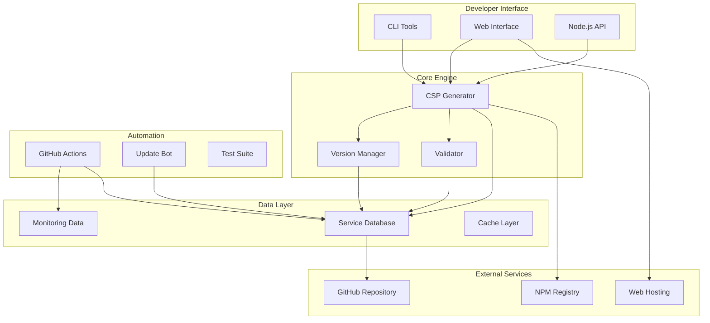
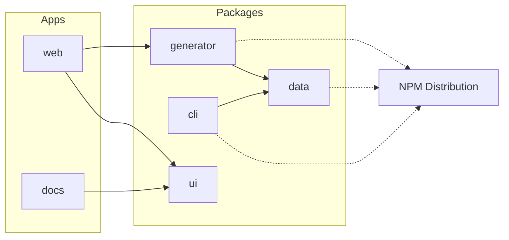
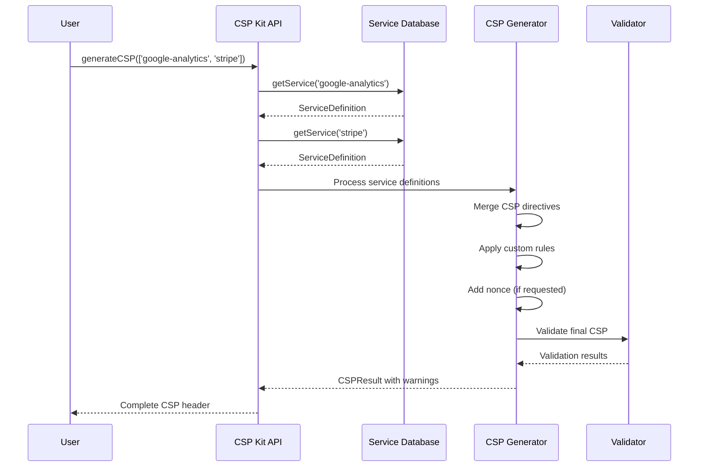
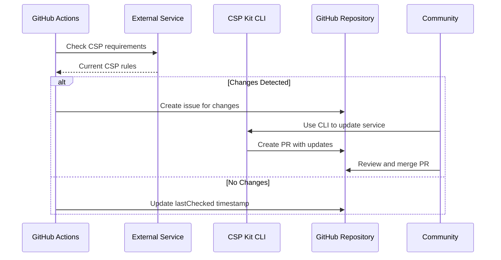

# CSP Kit Architecture

This document provides a comprehensive overview of the CSP Kit ecosystem architecture, design decisions, and implementation details.

## Table of Contents

- [System Overview](#system-overview)
- [Package Architecture](#package-architecture)
- [Data Flow](#data-flow)
- [Design Patterns](#design-patterns)
- [Technology Stack](#technology-stack)
- [Performance Considerations](#performance-considerations)
- [Security Architecture](#security-architecture)

## System Overview

### Core Concept

CSP Kit revolutionizes Content Security Policy management by introducing a **service-first approach**. Instead of manually crafting CSP directives, developers specify the services they use, and CSP Kit automatically generates the appropriate security policies.

```
Traditional Approach:
Developer → Manual CSP Rules → Security Policy

CSP Kit Approach:
Developer → Service Specifications → Auto-Generated CSP → Security Policy
```

### High-Level Architecture



## Package Architecture

### Monorepo Structure

CSP Kit follows a **data-package separation** architecture inspired by browserslist:

```
csp-kit/
├── packages/
│   ├── generator/            # Core CSP generation library
│   ├── data/                # Service definitions database
│   ├── cli/                 # Command-line interface
│   ├── eslint-config/       # Shared ESLint configuration
│   └── typescript-config/   # Shared TypeScript configuration
├── apps/
│   ├── web/                 # Next.js web interface
│   └── docs/                # Documentation site
└── docs/                    # Maintainer documentation
```

### Package Dependencies



### Core Packages

#### 1. `@csp-kit/generator` - Core Library

**Purpose**: CSP generation engine and public API

**Key Components**:

```typescript
// Generator - Core CSP generation logic
export function generateCSP(options: CSPOptions): CSPResult;

// Utilities - Helper functions for CSP manipulation
export function generateNonce(): string;
export function mergeCSPDirectives(...directives: CSPDirectives[]): CSPDirectives;

// Re-exports from data package for convenience
export { getService, searchServices, getServiceVersions } from '@csp-kit/data';
```

**Design Principles**:

- **Minimal Dependencies**: Only essential dependencies
- **Tree Shakeable**: Supports tree shaking for bundle optimization
- **Framework Agnostic**: Works with any Node.js or browser environment
- **TypeScript First**: Full TypeScript support with comprehensive types

#### 2. `@csp-kit/data` - Service Database

**Purpose**: Centralized database of service CSP requirements

**Key Components**:

```typescript
// Service Definitions
export const services: Record<string, ServiceDefinition>;

// Service Discovery
export function getService(id: string): ServiceDefinition | undefined;
export function searchServices(query: string): ServiceDefinition[];

// Version Management
export function getServiceWithVersion(id: string, version?: string): ServiceWithVersion;
export function getServiceVersions(id: string): string[];
export function getDeprecationWarning(id: string, version: string): string | undefined;
```

**Data Structure**:

```typescript
interface ServiceDefinition {
  id: string;
  name: string;
  category: ServiceCategory;
  description: string;
  website: string;
  officialDocs: string[];
  versions: Record<string, ServiceVersion>;
  defaultVersion: string;
  aliases?: string[];
  lastUpdated: string;
  monitoring?: ServiceMonitoring;
}
```

#### 3. `@csp-kit/cli` - Command Line Interface

**Purpose**: Automation and service management tools

**Key Features**:

- Interactive service addition
- Automated service updates
- CSP validation and testing
- GitHub integration for PR creation

#### 4. Web Interface

**Purpose**: User-friendly CSP generator with visual interface

**Technology Stack**:

- Next.js 15 with App Router
- React 19 with TypeScript
- Tailwind CSS v4
- Shadcn/ui components

## Data Flow

### CSP Generation Flow



### Service Update Flow



## Design Patterns

### 1. Data-Package Separation

**Problem**: Service CSP requirements change frequently, but the core library logic is stable.

**Solution**: Separate service data from library code, allowing independent updates.

**Benefits**:

- Service updates don't require library releases
- Community can contribute service definitions easily
- Data updates are faster and safer

### 2. Version-Aware Service Definitions

**Problem**: Services evolve their CSP requirements over time.

**Solution**: Store multiple versions of CSP requirements per service.

```typescript
{
  "versions": {
    "1.0.0": { csp: { /* old rules */ }, validFrom: "2023-01-01" },
    "2.0.0": { csp: { /* new rules */ }, validFrom: "2024-01-01", breaking: true }
  },
  "defaultVersion": "2.0.0"
}
```

**Benefits**:

- Backward compatibility support
- Gradual migration paths
- Clear deprecation timeline

### 3. Service-First API Design

**Problem**: Traditional CSP configuration is complex and error-prone.

**Solution**: Abstract CSP complexity behind service identifiers.

```typescript
// Before: Manual CSP configuration
const csp = "script-src 'self' https://js.stripe.com https://www.google-analytics.com";

// After: Service-based configuration
const result = generateCSP(['stripe', 'google-analytics']);
```

### 4. Plugin Architecture

**Problem**: Different environments need different CSP generation features.

**Solution**: Modular design with optional features.

```typescript
// Core generation
import { generateCSP } from '@csp-kit/generator';

// Optional utilities
import { generateNonce, validateDirectives } from '@csp-kit/generator/utils';

// Framework integrations (future)
import { nextjsPlugin } from '@csp-kit/generator/plugins/nextjs';
```

### 5. Community-Driven Updates

**Problem**: Maintaining service definitions at scale requires community involvement.

**Solution**: Automated workflows and easy contribution tools.

**Components**:

- GitHub Actions for monitoring
- CLI tools for easy contributions
- Issue templates for structured requests
- Automated validation and testing

## Technology Stack

### Core Technologies

| Component           | Technology        | Justification                      |
| ------------------- | ----------------- | ---------------------------------- |
| **Language**        | TypeScript        | Type safety, developer experience  |
| **Build System**    | Turborepo + tsup  | Monorepo optimization, fast builds |
| **Package Manager** | pnpm              | Efficient workspace management     |
| **Testing**         | Vitest            | Fast, modern testing framework     |
| **Linting**         | ESLint + Prettier | Code quality and consistency       |

### Runtime Dependencies

```json
// Minimal runtime dependencies for @csp-kit/generator
{
  "dependencies": {
    "@csp-kit/data": "workspace:*"
  }
}

// CLI dependencies for automation
{
  "dependencies": {
    "commander": "^12.0.0",    // CLI framework
    "inquirer": "^12.0.0",     // Interactive prompts
    "chalk": "^5.3.0",         // Terminal colors
    "got": "^14.0.0",          // HTTP client
    "cheerio": "^1.0.0"        // HTML parsing for service analysis
  }
}
```

### Development Dependencies

- **TypeScript**: 5.8.2 (latest stable)
- **Node.js**: >=24
- **ESLint**: 9.x (latest)
- **Prettier**: 3.x
- **Vitest**: 2.x

## Performance Considerations

### Bundle Size Optimization

**Tree Shaking Support**:

```typescript
// Only import what you need
import { generateCSP } from '@csp-kit/generator';
// vs
import { generateCSP, generateNonce, validateDirectives } from '@csp-kit/generator';
```

**Data Package Separation**:

- Service data is separate from core logic
- Data updates don't affect bundle size
- Optional data subsets for specific use cases

**Build Optimization**:

```typescript
// Multiple output formats
{
  "main": "./dist/index.js",      // CommonJS
  "module": "./dist/index.mjs",   // ES Modules
  "types": "./dist/index.d.ts"    // TypeScript definitions
}
```

### Runtime Performance

**Caching Strategy**:

```typescript
// Service lookup caching
const serviceCache = new Map<string, ServiceDefinition>();

export function getService(id: string): ServiceDefinition | undefined {
  if (serviceCache.has(id)) {
    return serviceCache.get(id);
  }

  const service = lookupService(id);
  if (service) {
    serviceCache.set(id, service);
  }

  return service;
}
```

**Lazy Loading**:

```typescript
// Service data is loaded on-demand
let servicesData: ServiceRegistry | null = null;

function getServicesData(): ServiceRegistry {
  if (!servicesData) {
    servicesData = require('./services.json');
  }
  return servicesData;
}
```

### Memory Management

**Efficient Data Structures**:

- Use Maps for frequent lookups
- Store only essential data in memory
- Implement garbage collection for caches

**Streaming for Large Operations**:

```typescript
// Process large service updates in chunks
async function validateAllServices(): Promise<ValidationResult[]> {
  const results: ValidationResult[] = [];

  for await (const serviceChunk of getServiceChunks()) {
    const chunkResults = await validateServiceChunk(serviceChunk);
    results.push(...chunkResults);
  }

  return results;
}
```

## Security Architecture

### Input Validation

**Service Identifier Validation**:

```typescript
function validateServiceIdentifier(id: string): boolean {
  // Only allow alphanumeric characters, hyphens, and version specifiers
  return /^[a-z0-9-]+(@[a-z0-9.-]+)?$/i.test(id);
}
```

**CSP Directive Validation**:

```typescript
function validateCSPDirective(directive: string, sources: string[]): string[] {
  const errors: string[] = [];

  // Validate directive name
  if (!VALID_DIRECTIVES.includes(directive)) {
    errors.push(`Invalid directive: ${directive}`);
  }

  // Validate sources
  for (const source of sources) {
    if (!isValidCSPSource(source)) {
      errors.push(`Invalid source: ${source}`);
    }
  }

  return errors;
}
```

### Data Integrity

**Service Definition Schema Validation**:

```typescript
import Ajv from 'ajv';

const ajv = new Ajv();
const validateService = ajv.compile(serviceDefinitionSchema);

export function validateServiceDefinition(data: unknown): string[] {
  const valid = validateService(data);

  if (!valid) {
    return validateService.errors?.map(err => err.message) || [];
  }

  return [];
}
```

**Cryptographic Hashing**:

```typescript
// Ensure service data integrity
function calculateServiceHash(service: ServiceDefinition): string {
  const content = JSON.stringify(service, Object.keys(service).sort());
  return crypto.createHash('sha256').update(content).digest('hex');
}
```

### Supply Chain Security

**Dependency Management**:

- Regular security audits with `pnpm audit`
- Automated dependency updates with Dependabot
- Lockfile verification in CI/CD

**Build Security**:

- Signed releases with GPG
- Reproducible builds
- Build artifact verification

### CSP Security Best Practices

**Conservative Defaults**:

```typescript
const DEFAULT_CSP_OPTIONS = {
  includeSelf: true, // Always include 'self'
  unsafeInline: false, // Never allow unsafe-inline by default
  unsafeEval: false, // Never allow unsafe-eval by default
  strictDynamic: false, // Conservative approach to strict-dynamic
};
```

**Nonce Generation**:

```typescript
import crypto from 'crypto';

export function generateNonce(length: number = 16): string {
  return crypto.randomBytes(length).toString('base64');
}
```

**Warning System**:

```typescript
export function validateDirectives(directives: CSPDirectives): string[] {
  const warnings: string[] = [];

  // Warn about unsafe directives
  if (directives['script-src']?.includes("'unsafe-inline'")) {
    warnings.push("'unsafe-inline' in script-src reduces security");
  }

  if (directives['script-src']?.includes("'unsafe-eval'")) {
    warnings.push("'unsafe-eval' in script-src is dangerous");
  }

  return warnings;
}
```

---

## Future Architecture Considerations

### Scaling Considerations

1. **Service Database Growth**:
   - Implement service data partitioning
   - Add service categorization and filtering
   - Consider database backend for large-scale deployments

2. **API Rate Limiting**:
   - Implement rate limiting for public APIs
   - Add caching layers for high-traffic scenarios
   - Consider CDN distribution for service data

3. **Multi-Region Support**:
   - Distribute service checking across regions
   - Implement regional service variations
   - Add latency-based routing

### Extension Points

1. **Plugin System**:

   ```typescript
   interface CSPPlugin {
     name: string;
     transform(directives: CSPDirectives): CSPDirectives;
     validate?(result: CSPResult): string[];
   }
   ```

2. **Custom Service Resolvers**:

   ```typescript
   interface ServiceResolver {
     resolve(id: string): ServiceDefinition | undefined;
     search(query: string): ServiceDefinition[];
   }
   ```

3. **Framework Integrations**:
   - Next.js plugin for automatic CSP generation
   - Webpack plugin for build-time CSP
   - Express middleware for runtime CSP

---

_Last Updated: 2024-06-29_
_Architecture Version: 1.0.0_
